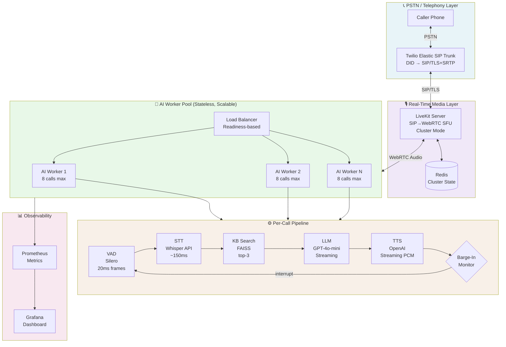
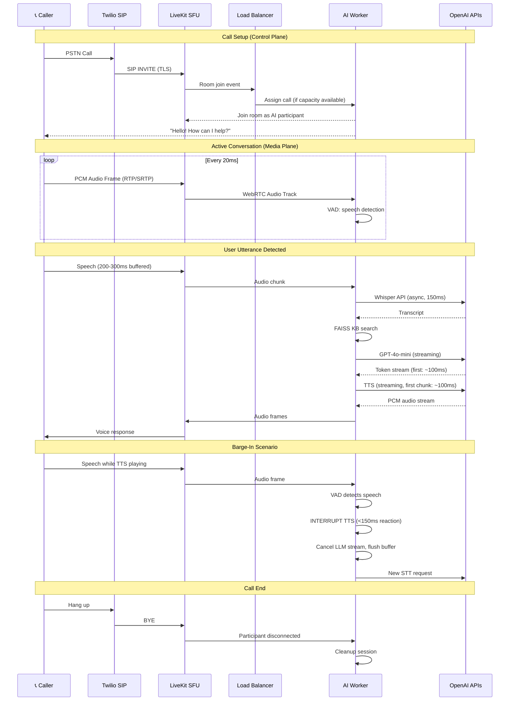
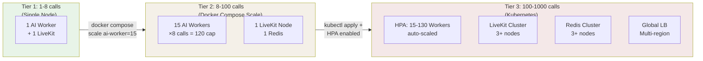

# Diagram 1: High-Level System Architecture

```mermaid
graph TB
    subgraph PSTN["📞 PSTN / Telephony Layer"]
        CALLER[Caller Phone]
        TWILIO[Twilio Elastic SIP Trunk\nDID → SIP/TLS+SRTP]
    end

    subgraph MEDIA["🎙 Real-Time Media Layer"]
        LK[LiveKit Server\nSIP→WebRTC SFU\nCluster Mode]
        REDIS[(Redis\nCluster State)]
        LK <--> REDIS
    end

    subgraph WORKERS["🤖 AI Worker Pool (Stateless, Scalable)"]
        direction TB
        W1[AI Worker 1\n8 calls max]
        W2[AI Worker 2\n8 calls max]
        WN[AI Worker N\n8 calls max]
        LB[Load Balancer\nReadiness-based]
        LB --> W1 & W2 & WN
    end

    subgraph PIPELINE["⚙️ Per-Call Pipeline"]
        direction LR
        VAD[VAD\nSilero\n20ms frames] --> STT[STT\nWhisper API\n~150ms]
        STT --> KB[KB Search\nFAISS\ntop-3]
        KB --> LLM[LLM\nGPT-4o-mini\nStreaming]
        LLM --> TTS[TTS\nOpenAI\nStreaming PCM]
        TTS --> BI{Barge-In\nMonitor}
        BI -->|interrupt| VAD
    end

    subgraph OBS["📊 Observability"]
        PROM[Prometheus\nMetrics]
        GRAF[Grafana\nDashboard]
        PROM --> GRAF
    end

    CALLER <-->|PSTN| TWILIO
    TWILIO <-->|SIP/TLS| LK
    LK <-->|WebRTC Audio| WORKERS
    W1 & W2 & WN --> PIPELINE
    WORKERS --> PROM

    style PSTN fill:#e8f4f8
    style MEDIA fill:#f0e8f8
    style WORKERS fill:#e8f8e8
    style PIPELINE fill:#f8f0e8
    style OBS fill:#f8e8f0
```

---

# Diagram 2: Call Flow (Media + Control Plane)

```mermaid
sequenceDiagram
    participant C as 📞 Caller
    participant TW as Twilio SIP
    participant LK as LiveKit SFU
    participant LB as Load Balancer
    participant W as AI Worker
    participant OAI as OpenAI APIs

    Note over C,OAI: Call Setup (Control Plane)
    C->>TW: PSTN Call
    TW->>LK: SIP INVITE (TLS)
    LK->>LB: Room join event
    LB->>W: Assign call (if capacity available)
    W-->>LK: Join room as AI participant
    W-->>C: "Hello! How can I help?"

    Note over C,OAI: Active Conversation (Media Plane)
    loop Every 20ms
        C->>LK: PCM Audio Frame (RTP/SRTP)
        LK->>W: WebRTC Audio Track
        W->>W: VAD: speech detection
    end

    Note over C,OAI: User Utterance Detected
    C->>LK: Speech (200-300ms buffered)
    LK->>W: Audio chunk
    W->>OAI: Whisper API (async, 150ms)
    OAI-->>W: Transcript
    W->>W: FAISS KB search
    W->>OAI: GPT-4o-mini (streaming)
    OAI-->>W: Token stream (first: ~100ms)
    W->>OAI: TTS (streaming, first chunk: ~100ms)
    OAI-->>W: PCM audio stream
    W->>LK: Audio frames
    LK->>C: Voice response

    Note over C,OAI: Barge-In Scenario
    C->>LK: Speech while TTS playing
    LK->>W: Audio frame
    W->>W: VAD detects speech
    W->>W: INTERRUPT TTS (<150ms reaction)
    W->>W: Cancel LLM stream, flush buffer
    W->>OAI: New STT request

    Note over C,OAI: Call End
    C->>TW: Hang up
    TW->>LK: BYE
    LK->>W: Participant disconnected
    W->>W: Cleanup session
```

---

# Diagram 3: Scaling Plan (1 → 100 → 1000 calls)

```mermaid
graph LR
    subgraph TIER1["Tier 1: 1-8 calls\n(Single Node)"]
        S1[1 AI Worker\n+ 1 LiveKit]
    end

    subgraph TIER2["Tier 2: 8-100 calls\n(Docker Compose Scale)"]
        S2A[15 AI Workers\n×8 calls = 120 cap]
        S2B[1 LiveKit Node\n1 Redis]
    end

    subgraph TIER3["Tier 3: 100-1000 calls\n(Kubernetes)"]
        S3A[HPA: 15-130 Workers\nauto-scaled]
        S3B[LiveKit Cluster\n3+ nodes]
        S3C[Redis Cluster\n3+ nodes]
        S3D[Global LB\nMulti-region]
    end

    TIER1 -->|docker compose\nscale ai-worker=15| TIER2
    TIER2 -->|kubectl apply +\nHPA enabled| TIER3

    style TIER1 fill:#e8f4e8
    style TIER2 fill:#f4f0e8
    style TIER3 fill:#f4e8e8
```
