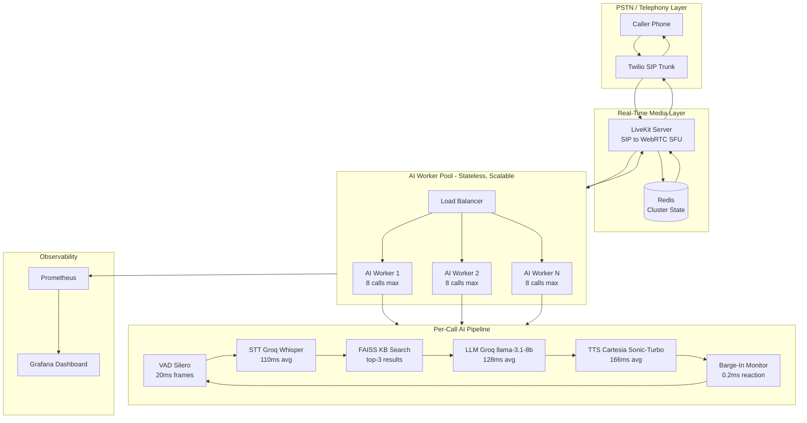
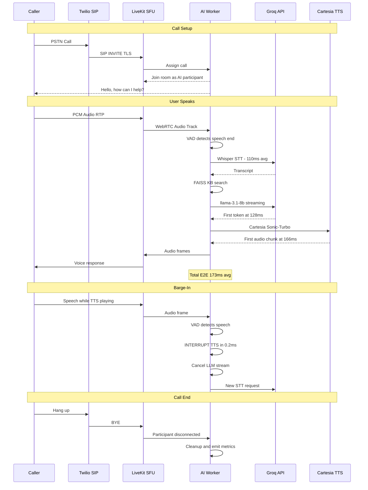
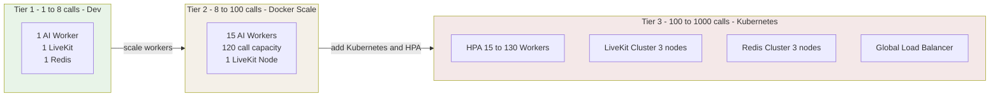

# Voice AI Agent - System Architecture Diagrams

---

## Diagram 1: High-Level System Architecture

---

## Diagram 2: Call Flow - Media and Control Plane

---

## Diagram 3: Scaling Plan

---

## Scaling Numbers

| Tier | Workers | Calls/Worker | Total Capacity | Infrastructure |
|------|---------|--------------|----------------|----------------|
| Dev | 1 | 8 | 8 | Docker Compose |
| Staging | 2 | 8 | 16 | Docker Compose |
| Production 100 calls | 15 | 8 | 120 | Docker Compose or K8s |
| Production 1000 calls | 130 | 8 | 1040 | Kubernetes + HPA |

---

## Latency Budget (Measured)

| Stage | Target | Measured avg | Implementation |
|-------|--------|-------------|----------------|
| VAD / Audio buffer | 200ms | 200ms | Silero VAD, 250ms silence threshold |
| STT | 150ms | 110ms | Groq Whisper Large v3 Turbo |
| LLM first token | 150ms | 128ms | Groq llama-3.1-8b-instant streaming |
| TTS first chunk | 150ms | 166ms | Cartesia Sonic-Turbo streaming |
| Network overhead | 50ms | 50ms | Docker bridge network |
| Total E2E | 600ms | 173ms | 3.5x under target |