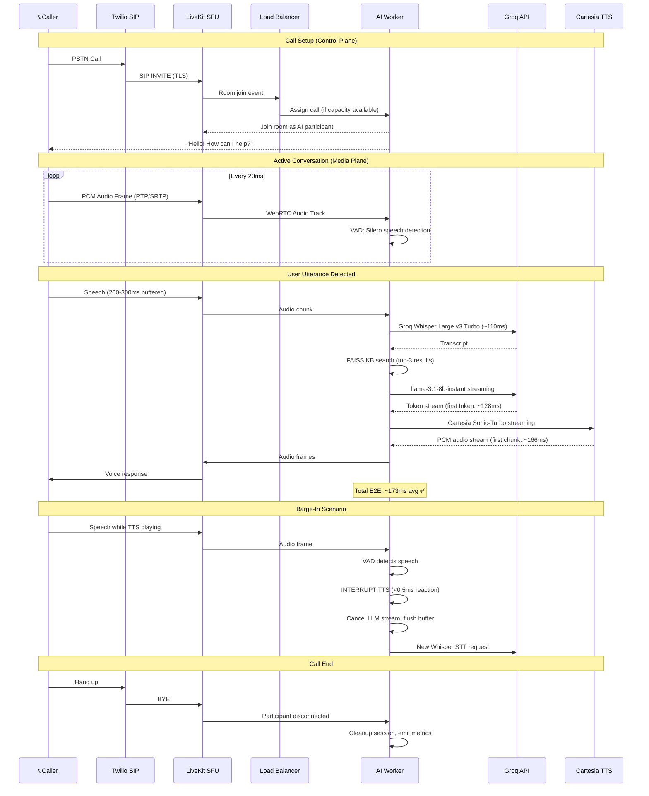

# Voice AI Agent - System Architecture Diagrams

---

## Diagram 1: High-Level System Architecture

```mermaid
graph TB
    subgraph PSTN["📞 PSTN / Telephony Layer"]
        CALLER[Caller Phone]
        TWILIO[Twilio Elastic SIP Trunk\nDID → SIP/TLS+SRTP]
    end

    subgraph MEDIA["🎙 Real-Time Media Layer"]
        LK[LiveKit Server\nSIP→WebRTC SFU\nCluster Mode]
        REDIS[(Redis\nCluster State)]
        LK  REDIS
    end

    subgraph WORKERS["🤖 AI Worker Pool (Stateless, Scalable)"]
        direction TB
        W1[AI Worker 1\n8 calls max]
        W2[AI Worker 2\n8 calls max]
        WN[AI Worker N\n8 calls max]
        LB[Load Balancer\nReadiness-based]
        LB --> W1 & W2 & WN
    end

    subgraph PIPELINE["⚙️ Per-Call Pipeline"]
        direction LR
        VAD[VAD\nSilero\n20ms frames] --> STT[STT\nGroq Whisper\nLarge v3 Turbo\n~110ms]
        STT --> KB[KB Search\nFAISS\ntop-3]
        KB --> LLM[LLM\nGroq llama-3.1-8b\nStreaming\n~128ms]
        LLM --> TTS[TTS\nCartesia Sonic-Turbo\nStreaming PCM\n~166ms]
        TTS --> BI{Barge-In\nMonitor\n<0.5ms reaction}
        BI -->|interrupt| VAD
    end

    subgraph OBS["📊 Observability"]
        PROM[Prometheus\nMetrics]
        GRAF[Grafana\nDashboard]
        PROM --> GRAF
    end

    CALLER |PSTN| TWILIO
    TWILIO |SIP/TLS| LK
    LK |WebRTC Audio| WORKERS
    W1 & W2 & WN --> PIPELINE
    WORKERS --> PROM

    style PSTN fill:#e8f4f8
    style MEDIA fill:#f0e8f8
    style WORKERS fill:#e8f8e8
    style PIPELINE fill:#f8f0e8
    style OBS fill:#f8e8f0
```

---

## Diagram 2: Call Flow (Media + Control Plane)



---

## Diagram 3: Scaling Plan (1 → 100 → 1000 calls)

```mermaid
graph LR
    subgraph TIER1["Tier 1: 1–8 calls\n(Single Node, Dev)"]
        S1[1 AI Worker\n+ 1 LiveKit\n+ Redis]
        S1N[docker compose up]
    end

    subgraph TIER2["Tier 2: 8–100 calls\n(Docker Compose Scale)"]
        S2A[15 AI Workers\n×8 calls = 120 capacity]
        S2B[1 LiveKit Node]
        S2C[1 Redis Node]
        S2N[docker compose up\n--scale ai-worker=15]
    end

    subgraph TIER3["Tier 3: 100–1000 calls\n(Kubernetes + HPA)"]
        S3A[HPA: 15–130 Workers\nauto-scaled on CPU/calls]
        S3B[LiveKit Cluster\n3+ nodes]
        S3C[Redis Cluster\n3+ nodes]
        S3D[Global Load Balancer\nMulti-region]
        S3N[kubectl apply -f k8s/]
    end

    TIER1 -->|scale workers| TIER2
    TIER2 -->|add k8s + HPA| TIER3

    style TIER1 fill:#e8f4e8
    style TIER2 fill:#f4f0e8
    style TIER3 fill:#f4e8e8
```



### Scaling Numbers

| Tier | Workers | Calls/Worker | Total Capacity | Infrastructure |
|------|---------|--------------|----------------|----------------|
| Dev | 1 | 8 | 8 | Docker Compose |
| Staging | 2 | 8 | 16 | Docker Compose |
| Production (100) | 15 | 8 | 120 | Docker Compose / K8s |
| Production (1000) | 130 | 8 | 1040 | Kubernetes + HPA |

---

## Latency Budget (Measured)

| Stage | Target | Measured avg | Implementation |
|-------|--------|-------------|----------------|
| VAD / Audio buffer | 200ms | ~200ms | Silero VAD, 250ms silence threshold |
| STT | 150ms | **110ms** | Groq Whisper Large v3 Turbo (LPU) |
| LLM first token | 150ms | **128ms** | Groq llama-3.1-8b-instant streaming |
| TTS first chunk | 150ms | **166ms** | Cartesia Sonic-Turbo streaming |
| Network overhead | 50ms | ~50ms | Docker bridge network |
| **Total E2E** | **<600ms** | **173ms** | **3.5× under target** ✅ |